```{r setup, include=FALSE}
knitr::opts_chunk$set(echo = FALSE)
```

# 1. Critique of the Visualisation

This is the original visualisation.


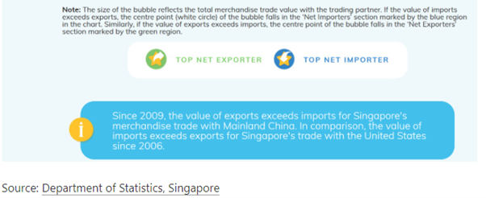

## 1.1 Clarity

1.	The visualisation has no title. Hence, the intention of the visualisation is unclear to individuals looking at the visualisation. Is the purpose of the visualisation to see if a trading market has a higher volume of imports or exports? Or is the purpose to see how the total merchandise trade volume differs across these ten markets?  

    With the absence of a title, individuals would also have no clue about the timeframe of the data, i.e. is the data indicative of trade value at a particular point of time or is the data indicative of cumulative trade value for a certain time period? Also, are we trying to observe the trade trends over time or are only interested in total trade performance for the entire time period, i.e., considering only the total trade volume for the entire ten years from January 2011 to December 2020.  

    Besides that, there are only ten data points indicated on the visualisation. Was there a particular reason why the data for these markets/countries were chosen to be displayed? If yes, why? Individuals would have to try to interpret what the visualisation is trying to show from any other annotations or notes on the visualisation.

2.	It is unclear if the visualisation is looking at market/country level data or at region level data. One assumption we may make is that this visualisation is focusing on the top ten trading markets from the data source. After we clean up the data source, we see that the top ten trading markets (summing up both imports and exports) are Asia, Europe, Mainland China, America, Malaysia, European Union (EU) United States, Indonesia, Hong Kong and Taiwan.  

    These markets tally with most, but not all of the data points in the visualisation. Furthermore, we note that the visualisation has data for the EU (which is an economic union of various countries in Europe like France, Germany etc) reflected in the visualisation but all other data points reflect market/country level data. If we look at the data source, we see that data for the individual countries (France, Germany, Belgium etc.) which make up the EU can be found as well. This again makes the intention of the visualisation more unclear as the EU (which is a cluster of countries) would naturally and obviously have a higher volume of trade than the individual member countries. The same can be observed for America and the United States where the United States is a part of America.  

    With the above said, it is difficult to know if the visualisation is focusing on market/country level data or region level data.

3.	Both axes of the visualisation have no units. While the data points in the visualisation have values associated with them (measured in S$ billions), it would be much clearer if there was proper indication of the unit of measurement for both axis.

4. There is a note at the bottom of the visualisation which talks about how the value of exports exceeds imports for Singapore’s merchandise trade with Mainland China from 2009 while the opposite is true of Singapore’s merchandise trade with United States since 2006. While this is an interesting piece of information to note, such details cannot be inferred from the visualisation and hence, there is no way for individuals to verify this piece of information.

  


## 1.2 Aesthetic

1.	There is poor and excessive use of colours in the visualisation. This makes it difficult to focus on the visualisation. If we want objects in a visualisation to be easily seen, we should use a background colour that contrasts sufficiently with the objects. However, in this case, even though the background of the visualisation is blue, there are still so many other blue toned objects.

2.	While there is a note to explain what the size of the bubbles indicate and the significance of the location where the centre points lies, it is difficult to see where the centre points lie exactly for certain points due to the opacity of the bubbles.  

    There is so much overlapping between the data points that some of the centre points are totally blocked: the centre points for the Republic of Korea and the EU are totally blocked. Viewers cannot even tell whether the centre points lie in the blue or green region.


3.	Tick marks and clear inkings are necessary on continuous scale for clarity but there is none for this visualisation.

# 2.0 Alternative Design

The proposed design is as follows:

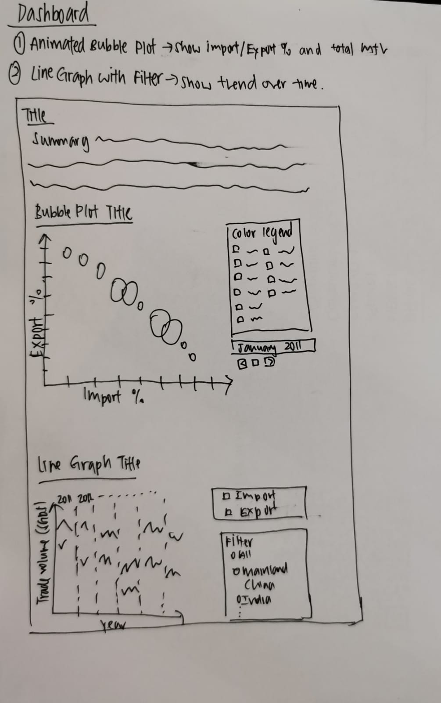

## 2.1 Clarity

1. We utilise 2 charts - an animated bubble plot and a line graph with a filter to convey the necessary information.

    + The bubble plot will show how each country's total trade volume, percentage of imports and percentage of exports change over time from January 2011 to December 2020. 
    
    + The line graph will show the total trend for import and export volume over time from January 2011 to December 2020. 

2. We will include a title in our proposed visualisation to make the intent of our visualisation clear. We will also include a summary to further explain what information our visualisation is conveying.

3. We will look solely at market/country level data to create a fair ground for comparison. More specifically, we will be looking at the import and export volumes for the top 10 trading markets/countries (ranking based on cumulative import and export volumes from January 2011 to December 2020). This intent will indicated clearly in the title.

4. For clarity, we will include units on both the X-axis and Y-axis as and when necessary..


## 2.2 Aesthetic

1. Our bubble plot will have a reduced opacity to ensure that overlapping bubbles can still be seen.

2. We will use a simple white background for both the bubble plot and line graph to help contrast against any other colour on the both charts.

3. We will include tick marks on our axes and ensure that our charts are clearly inked.

# 3.0 Proposed Visualisation

Please view the proposed visualisation on Tableau Public [here.](https://public.tableau.com/app/profile/joanna.lian/viz/DataViz2_16235105075420/Story1)

# 4.0 Step-by-step Guide
We will provide a step-by-step guide on how to create our proposed alternative  data visualisation.

**Data Sources**

The datasets used for this data visualisation were extracted from [singstat]( https://www.singstat.gov.sg/find-data/search-by-theme/trade-and-investment/merchandise-trade/latest-data.). Specifically, they can be found under the following sections:

*	[Merchandise Imports By Region/Market, Monthly](https://www.tablebuilder.singstat.gov.sg/publicfacing/createDataTable.action?refId=15544)
*	[Merchandise Exports By Region/Market, Monthly](https://www.tablebuilder.singstat.gov.sg/publicfacing/createDataTable.action?refId=15534)

**Data Preparation**

Screenshots of the raw dataset are as shown below:


It is noted that we do not need many of the data present in the raw dataset and also, there is some other data that we need but are not available in the dataset. Hence, we will conduct some transformation of the data.

The data transformation steps (done in Microsoft Excel) are as follows:

*	For both tables, we removed data from January 1976 to December 2010 and from January 2021 to April 2021. We also removed the data which represent regional values – rows 8 to 13 in the raw datasets. This is because we are interested only in country-level data for this visualisation.

*	We created a new table which indicates total merchandise trade volume, i.e. the sum of exports and imports, for each market for each month from January 2011 to December 2020. In this new table, we add a column at the far end to sum up the total trade for each market for the entire time period from January 2011 to December 2020.

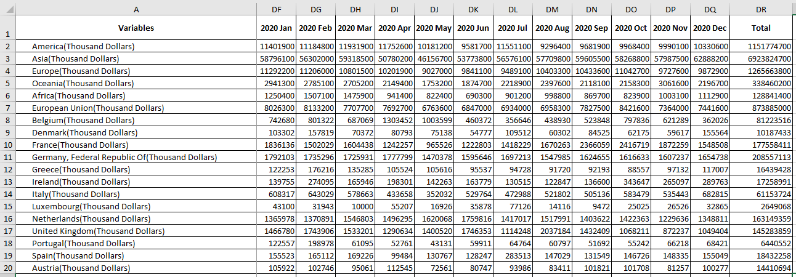

*	Next, using the total merchandise trade volume table, we ranked the markets according to the total trade conducted between January 2011 to December 2020. We are only interested in the top ten markets which are in order – Mainland China, Malaysia, United States, Indonesia, Hong Kong, Taiwan, Japan, Republic of Korea, Thailand and India.

*	Lastly, we cleaned up and reformatted the data with the categories: month, country, import, export and total to make it easier to use on Tableau.

The transformed dataset is shown below:


This dataset is then uploaded into Tableau.

We will now create our visualisation which is an interactive and animated dashboard consisting of a bubble plot and a line graph.

## 4.1 Bubble Plot

Firstly, we use an animated bubble plot to illustrate how total trade volume and import/export percentages change during the time period from January 2011 to December 2020 for the top ten markets.

1.	We create 4 new calculated fields under the Analysis tab.

    + Exports
    
    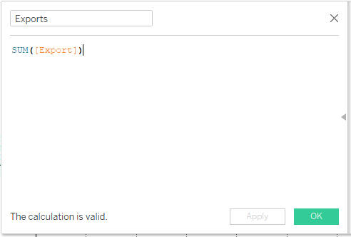
    
    
    + Imports
    
    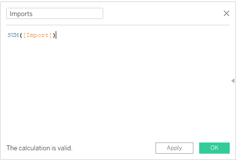
    
    
    + Exports %
    
    
    
    
    + Imports %

    

2. Drag **Exports %** from Measures to Columns and **Imports %** from Measures to Rows. By default, the aggregate of both measures is taken.


3. Next we drag **Country** to **Color**. 

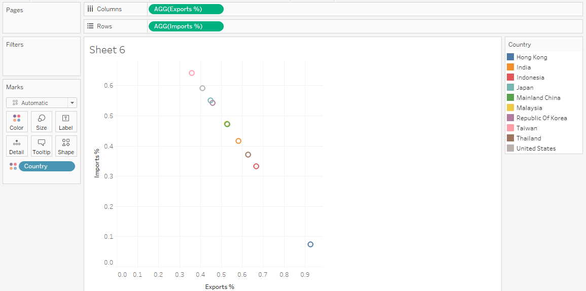  

4. We change the format of the marks from 'Automatic' to 'Circle'.
  
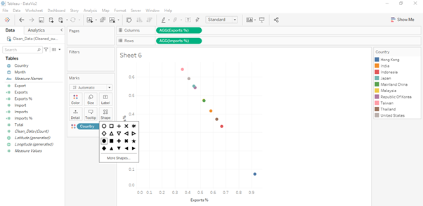

5. Next, we edit the format of the Y-axis to reflect percentages(%). We do the same for the X-axis.


6. We drag **Total** to **Size**. The size of the bubble will be directly proportionate to the volume of trade.


7.	We add a border and increase the size of the bubbles to improve the aesthetics of the bubble plot. We also reduce the opacity of the bubbles.

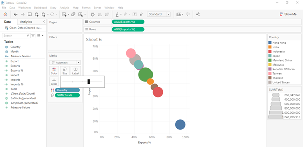


8. We now want to edit the tool tips.


  We drag **Import, Export, Total and Country** to **Tooltip**.
  


  The below is the new tooltip. 


9. We drag **Month** to **Pages** and select the **Month** of Month. We turn on the animation on the Analysis tab.

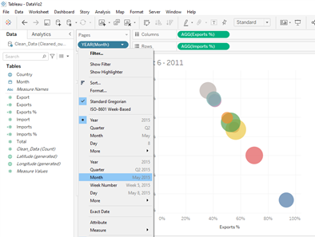


10. We edit the title of the bubble plot.


The below is the end result.


## 4.2 Line Graph

We now create a line graph with a filter to illustrate the trend for imports and exports from January 2011 to December 2020. 

1.	Drag **Month** from Dimensions to Columns and **Export** and **Import** from Measures to Rows. By default, the sum of of the two measures is taken.


2.  We right-click on **Import** and select 'Dual Axis'. We make sure to synchronise the axis.

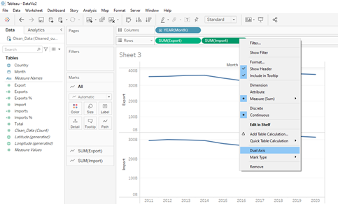
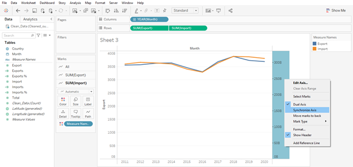

3. We expand the 'Year' of **Month** to include 'Month' of **Month** and select 'Entire View' to view entrire graph at a glance.

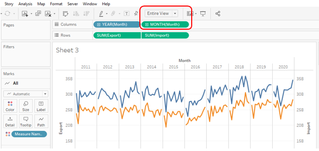

4. Click on **Color** and change the line type to one with markers.

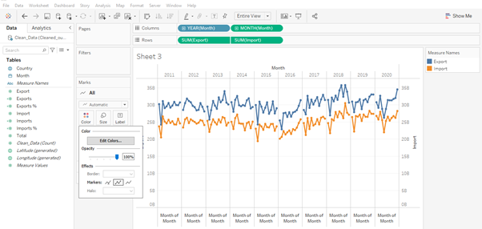

5. As before, we edt the title and the axes accordingly. For both of the Y-axis, we unselect the 'Include Zero' button.

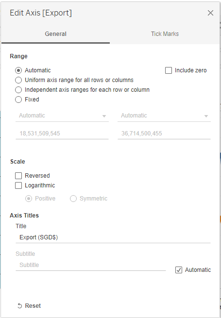


6. Last but not least, we drag **Country** to **Filter**. We select 'Show Filter'.


We want to show the filter as a single list.


This is the end product.

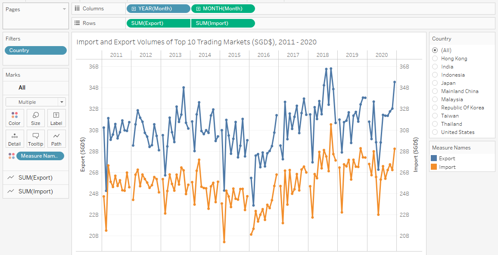


## 4.4 Dashboard

We create an animated and interactive dashboard which combines the bubble plot and the line graph which we have created.


## 4.5 Story

As a final step, we create a story on Tableau using the dashboard that we have created. We drag the dashboard that we have created to the story and add in an appropriate title and caption.


# 5.0 Three major observations

1. Amongst these ten markets, we see from our bubble plot that the proportion of imports and exports for Taiwan, Indonesia and Hong Kong are the most consistent, i.e. the volume of imports is consistently higher than the volume of exports when considering Singapore's trade relationship with Taiwan while the opposite is true for Singapore's trade relationship with Indonesia and Hong Kong.  

    For all other markets, we see that the import % and export % fluctuate quite a bit. Some related observations include the interesting occurrence of the % changes for the United States where the volume of imports exceeded the volume of exports for the first time during this time period in April 2020. 


2. We can clearly see the growth and development of Singapore's trade relationship with  Mainland China's through our visualisation. Total trade volume grew from SGD$8.8B in January 2011 to SGD$13.3B in December 2020. Both the volume of imports and exports have increased but definitely, the growth in the volume of exports has outpaced the growth in imports.  


3. As a totality, the export and import trends with these top ten trading markets do rise and fall together. We also see that as a totality, Singapore's export volume with these top ten trading markets are consistently higher than its imports.  

    As a highly developed economy, Singapore's main exports include electrical machinery and equipment, machinery including computers,mineral fuels including oil and optical, technical, medical apparatus.


