```{r setup, include=FALSE}
knitr::opts_chunk$set(echo = FALSE)
```

# 1. Critique of the Visualisation

These are the original visualisations.

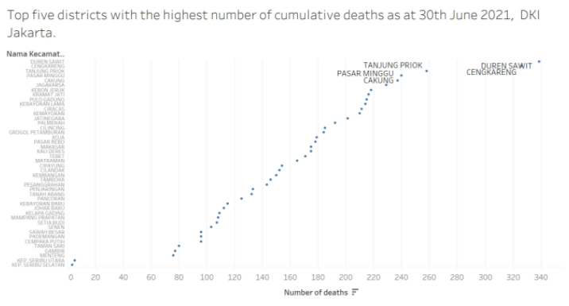
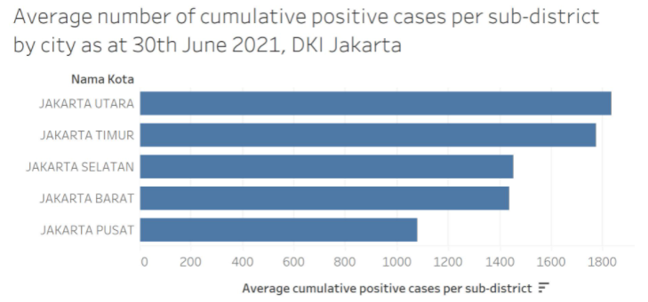

## 1.1 Clarity

1.	For the first visualisation, the title indicates that the chart will display information about the top 5 districts with the highest number of cumuative deaths as of 30th June 2021. However, the visualisation has points indicated for the number of deaths for all districts. Futhermore, labels are available only for the top 3 districts with the highest number of deaths,  

    In summary, the title of the visualisation is not aligned with the actual visualisation.  

2.	For the second visualisation, a bar chart is used to illustrate the average number of cumulative positive cases per sub-district by city as of 30th June 2021. It is not advised to use bar charts to display average/mean values. We explain further.  

    A mean value is computed via a process that is symmetric, i.e. its is influenced to the same degree by values that are located at equal distances above and below the mean. When a mean is depicted in a bar graph, however, that depiction is asymmetric. The mean itself is represented by the farthest edge of a bar that originates from one particular axis, most typically below the mean. This may lead people who view bar charts to reflexively prioritize regions within the bars over equivalent regions outside the bars. This is statistically incorrect.  

    Adding error bars onto the bar chart will help to mitigate this problem.  

3.	These 2 visualisations separately show us information about the number of deaths and the number of positive cases. However, the visualisations do not provide any information on the mortality rate amongst the number of individuals who test positive for COVID. Mortality rate is an important statistic that should not be neglected. District A with a lower number of positive cases may not be better off than District B with a higher number of positive cases as District A might have a higher mortality rate among their positive cases.  

    Hence, in order to get a more holistic understanding of the COVID situation in each district, we will be introducing a new measure - mortality rate in our proposed visualisation.  

4. As with all surveys, there is a certain level of uncertainty. However, dot plots and bar charts do not acount for uncertainty. To deal with this uncertainty, we will utilise bar charts with error bars (as mentioned above) and a funnel plot.  

    A funnel plot is a scatterplot of treatment effect against a measure of study precision. It is used primarily as a visual aid for detecting bias or systematic heterogeneity. A symmetric inverted funnel shape arises from a ‘well-behaved’ data set, in which bias is unlikely. An asymmetric funnel indicates a relationship between treatment effect estimate and study precision. This suggests the possibility of either bias or a systematic difference between studies of higher and lower precision (typically ‘small study effects’). Asymmetry can also arise from use of an inappropriate effect measure. Whatever the cause, an asymmetric funnel plot suggests that there needs to be investigation of possible causes.  

## 1.2 Aesthetic

1.	For the dotplot in the first visualisation, there are so many labels on the Y-axis that it is difficult that the plot looks cluttered and it is difficult to determine at a glance which point is representative of which district.  

2.	As briefly mentioned earlier on, for the first visualisation, only the dots for the top 3 districts with the highest number of deaths have labels. Aesthetically, this is inconsistent.

3.	While the titles and the X-axis labels are in English for both visualisations, the Y-axis label is in Bahasa Indonesian. This will confuse viewers.

# 2.0 Alternative Design

The proposed design is as follows:  


## 2.1 Clarity

1. We will introduce new measures - mortality rate and other statistical measures needed to construct confidence intervals.  

2. We utilise 2 charts - a funnel plot and a bar chart with error bars to convey the necessary information. 

    + The funnel plot will provide information about the mortality rate among the positive cases by district and it will also allow us to investigate if the results were significant or not. In statistics, we usually classify something is significant if the result we obtain is further than 2 standard deviations from the mean. That is if the data falls outside of 95% what we expect the value should be, then we draw attention to it. More details on how we construct our funnel plot will be provided later on.
    
    + The bar chart with error bars will provide information on the number of cumulative positive cases per sub-district by city as of 30th June 2021 and account for the uncertainty which is encountered when dealing with averages/means.

3. We will include a relevant title in our proposed visualisation to make the intent of our visualisation clear.

4. We will standardise the language present in the visualisations to English for easy comprehension by viewers. 


## 2.2 Aesthetic

1. We will utilise interactive tooltips to indicate clear labels for all necessary points. Tooltips is an efficient way to convey information about any point without causing the visualisation to look busy and cluttered.

2. We will use only English in the visualisation for standardization.

3. As we will be introducing additional new measures, we will include a legend in the visualisation as and when necessary.

# 3.0 Proposed Visualisation

Please view the proposed visualisation on Tableau Public [here.](https://public.tableau.com/app/profile/joanna.lian/viz/Dataviz3_16266183796800/Story1)

# 4.0 Step-by-step Guide
We will provide a step-by-step guide on how to create our proposed alternative  data visualisation.

**Data Sources**

The datasets used for this data visualisation were extracted from [from Open Data Covid-19 Provinsi DKI Jakarta.](https://riwayat-file-covid-19-dki-jakarta-jakartagis.hub.arcgis.com/).  

For creating the data visualisation above, the file dated on [30 Juni 2021 Pukul 10.00](https://drive.google.com/file/d/1poga1-JipsMsaeOM6hIFELTKWA4F3ITe/view) is used.  

**Data Preparation**

Screenshots of the raw dataset are as shown below:


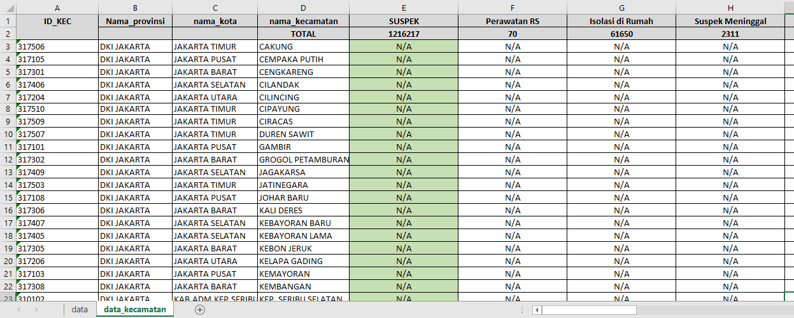

It is noted that there are many columns with **N/A** values in the dataset. While these columns have a **Total** value in row 2, the absence of information in the subsequent rows mean that these columns will not provide useful information for our analysis later on.  

Hence, we delete row 2 and columns E to Z. Hence, we have the below transformed datasets which we will upload onto Tableau.

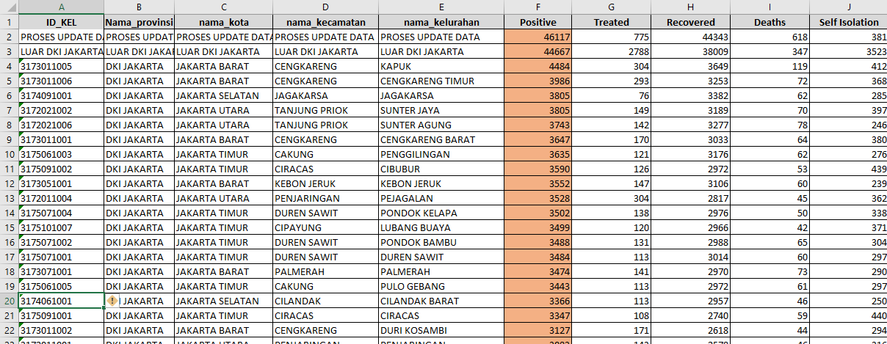


We will now create our visualisations.

## 4.1 Funnel Plot

1. Firstly, we create the required calculated fields.  

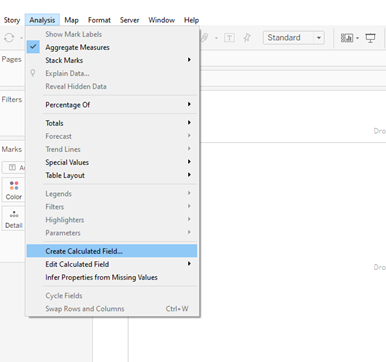  

* Denominator:
    
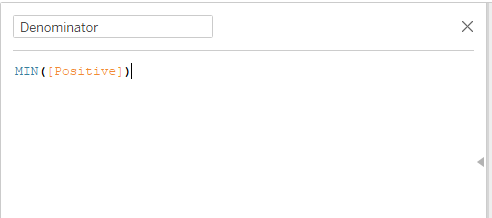

This will be the X-axis for our visualisation.  
    
* Max Denominator:
    

    
This is used to create padding for the upper and lower limits.  
    
* Min Denominator:


This is used to create padding for the upper and lower limits.  
    
* Numerator:

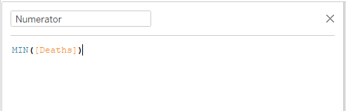

* Max Numerator:
    
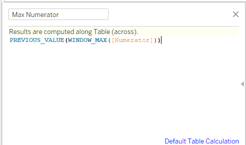
    
* Min Numerator:  
    
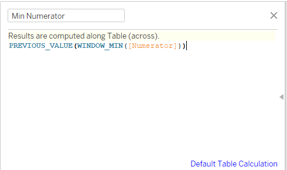

* Bin Increment:


This increment is very important. The number “1000” helps to make the upper and lower limits smooth.  
    
* Calculated bin: 
    

    
* Prop:
    


* Mean value: 

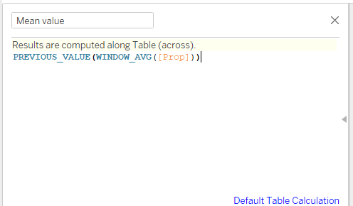
    
* Standard Error
    


* Z_95
    
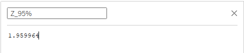   

* Z_99
    
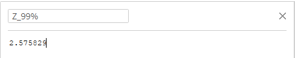   
    
* Lower Limit 95%
    
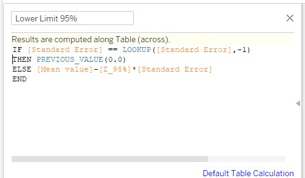

* Upper Limit 95%
    
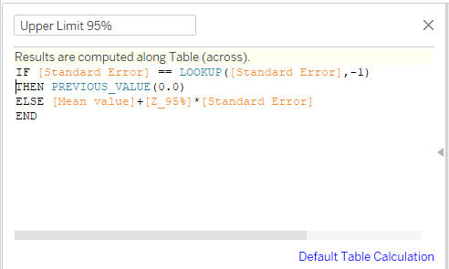

* Lower Limit 99%
    


* Upper Limit 99%
    


* Significance
    


2. Now, we start working on the visualisation. Drag **Denominator** to **Columns**. By default, the aggrgate is taken.  

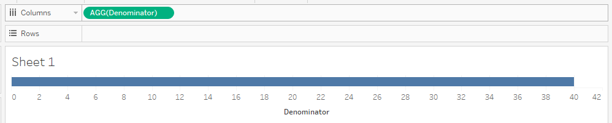

3. Drag **Prop** and **Measure Values** to the rows. Make them a dual-axis, and make sure to synchronise the axis.

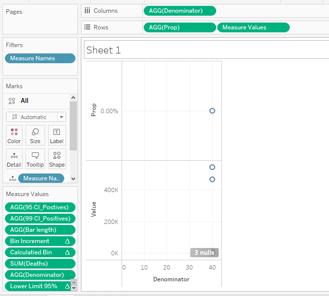

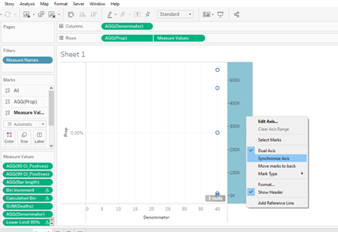


4. For the measure values, we will keep only **Lower Limit 95%**, **Lower Limit 99%**, **Upper Limit 95%**, **Upper Limit 99%** and **Mean value**.

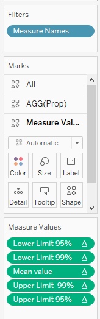

5. Convert **Prop** into a circle mark and convert the **Measure Values** into a line.


6. Drag **Significance** to the colour tab for **Prop**.


7. Add **District Name** to the details tab for both **Prop** and the **Measure Values**. 

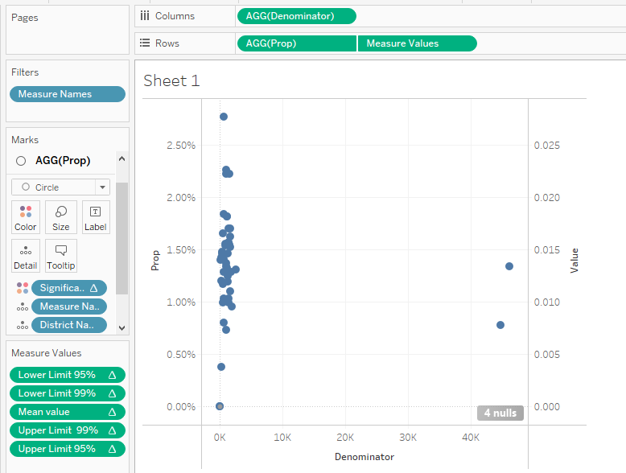
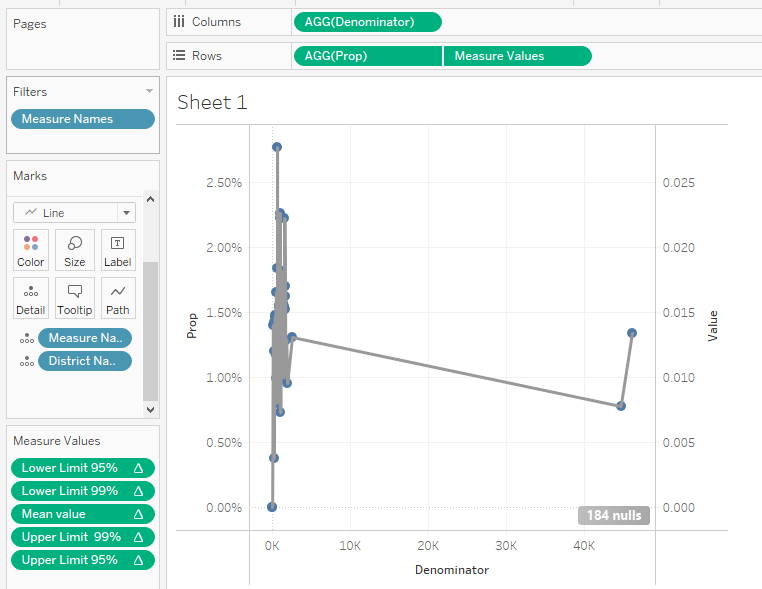

8. Compute all measure values along the **District Name**.

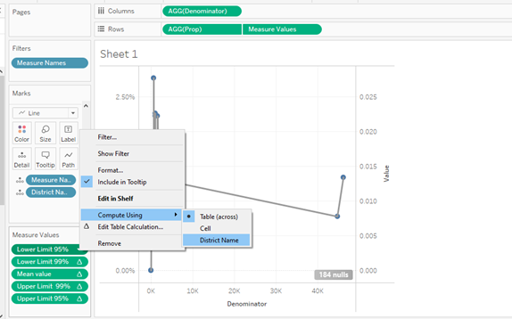

This is the visualisation we get after computing measure values along **District Name**.
    
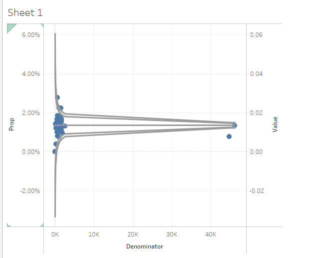

9. Drag **District Name** to the detail tab of **Prop** and also drag **Denominator** to the tooltip tab of **Prop**.


10. Drag **Measure Names** to the color tab of **Measure Values** and drag **Deaths** to the detail tab.


This is the visualisation we obtain.
    


11. Now, we edit the tooltips under **Prop**. There will be no tooltips for the meausre values, i.e. the lower and upper limits of the 95% and 99% confidence intervals.


12. We edit the title of the X- axis to **No. of positive COVID cases**, amend the title of the left Y-axis to **Mortality rate (%)**, convert the right Y-axis to a percentage format.

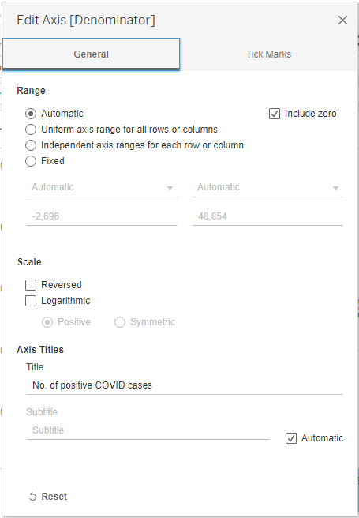


13. Now, we edit the title of the funnel plot to **COVID Mortality Rate (Jarkata) Funnel Plot**. We also include a legend for the measure values in the visualisation.


14. Last but not least, we exclude the two data points on the far right of the funnel plot as they represent data for Jakarta as a whole. We are only interested in looking at data on a district level for the purpose of this visualisation.


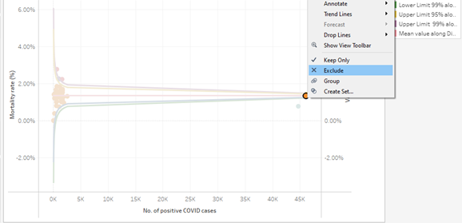

We now have this final visualisation.


## 4.2 Bar Chart with Error Bars
 
1. Firstly, we create the required calculated fields.

* SE_Positives

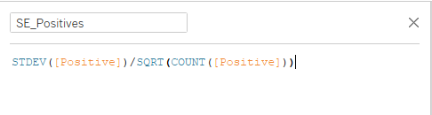

* 95 CI_Positives

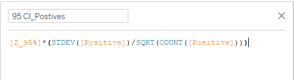

* 99 CI_Positives

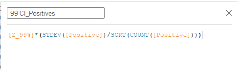

* Lower bar 95_Positives


* Upper bar 95_Positives


* Lower bar 99_Positives

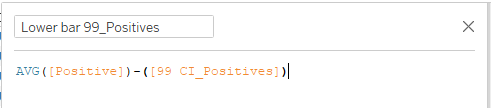

* Upper bar 99_Positives


* Bar length

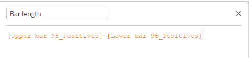

2.	Drag **City Names** to **Rows**.


3.	Drag **Positives** to **Columns** and take the average. Also, drag the **Measure Values** to **Columns**. Similar to before, we construct a dual axis and synchronise the axis.  

  

We only keep the below 4 measure values.

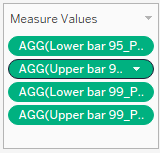

4. On the **Positives** tab, we select bar chart.

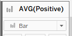

5. Now, we create the error bars.  

* Drag **Lower bar 95_Positives**, **Upper bar 95_Positives**, **Lower bar 99_Positives** and **Upper bar 99_Positives** to the detail tab on the **Measure Values** card.  

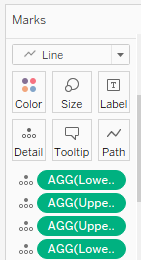  

* Right-click the axis in the view and select Add Reference Line.

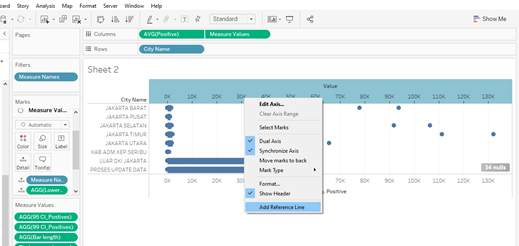

* In the Add Reference Line, Band, or Box dialog, do the following and click OK:
    
    + Select **Band**.  
    + For Scope, select **Per Cell**.  
    + For Band From in the Value dropdown, select *8AGG(Lower bar 95_Positives)**.
    + For Band From in the Label dropdown, select **None**.
    + For Band To in the Value dropdown, select **AGG(Upper bar 95_Positives)**.  
    + For Band To in the Label dropdown, select **None**. 
    + For Formatting in the Line dropdown, select **None**.  
    + For Formatting in the Fill dropdown, select **None**.    
    
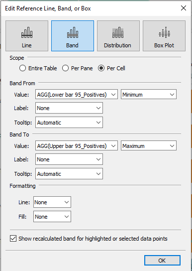

We repeat the same process but with Lower bar 99_Positives as the Band From value and Upper bar 99_Positives as the Band To value.


6. Drag **City** to **Filters** and select only the cities as per below image.


7. Now, we drag **Measure Names** to both the colour tab and the path tab of the **Measure Values** card. Also, we choose to display our measure values as a line.


8. Drag **Measure Names** to both the colour tab and the detail tab of the **Positives** card

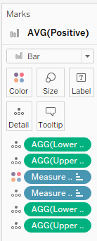

9. Modify the tooltips as below.

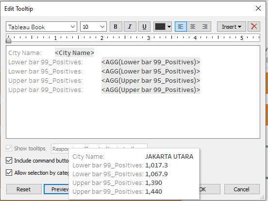


10. We edit the title of the axis and the title of the visualisation.  


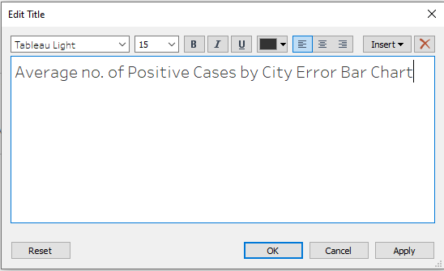

  This is our end product.


## 4.3 Dashboard

We create an animated and interactive dashboard which combines the funnel plot and the error bar plot which we have created.

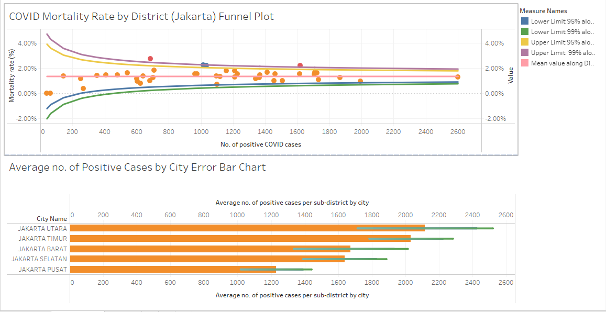

## 4.4 Story

As a final step, we create a story on Tableau using the dashboard that we have created. We drag the dashboard that we have created to the story and add in an appropriate title and caption.

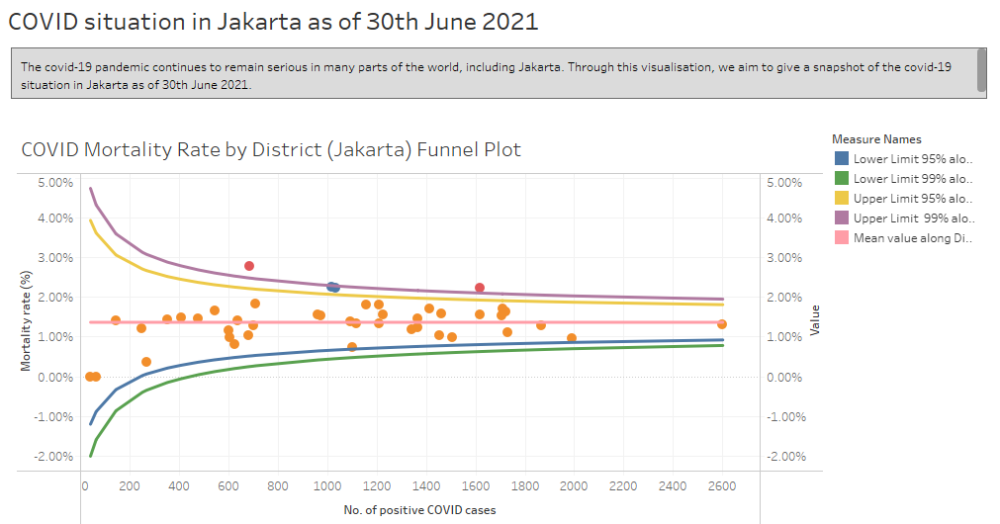
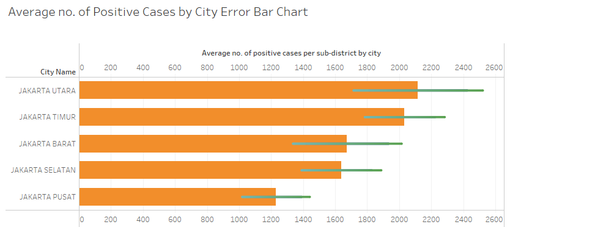

# 5.0 Three Major Observations

1. Including the mortality rate measure has given us additional insight into the covid-19 situation in the different districts.

    Just by looking at the top 3 districts, we can see how Johar Baru has a lower number of covid cases but a higher mortality rate than Kali Deres and Duren Sawit. It will be worthwhile to deep-dive as to why this is so - could it be that Johar Baru has a higher proportion of elderly and possibly a lower rate of vaccinations as compared to the other districts?
    
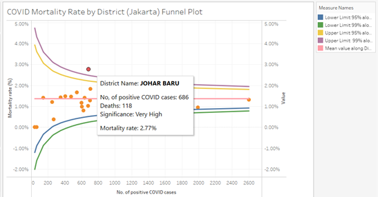


2. Looking at the error barplot has made it clear how important it is to factor in uncertainty into this particular visualisation. For the healthcare sector, this has far-reaching implications on the capacity/occupancy rate in hospitals. 

In the case of Jakarta Utara, this uncertainty has an impact on hundreds of positive cases. An additional 500 to 800 cases could easily overwhelm public healthcare facilities and it is crucial to plan ahead for these dire situations.

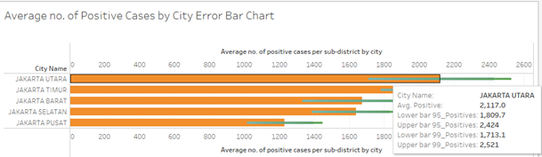

3. We note that there are some anomalous districts with very few cases and a low mortality rate. 

    While this might be a good sign, it is important to deep-dive and understand why these districts have such good results. Although these results could be the result of good social distancing practices and stellar hygiene standards, these good results could also be the result of under-testing and/or under-reporting which are both undesirable practices.

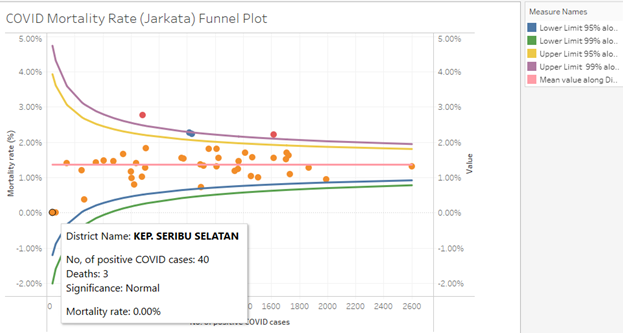
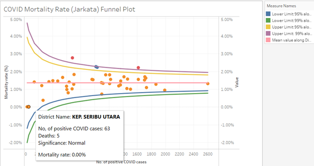


