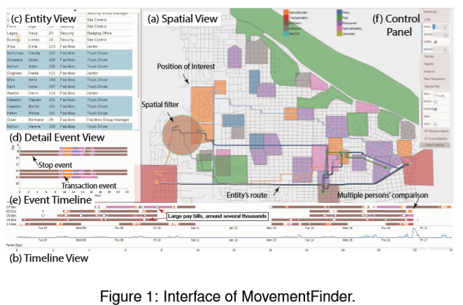
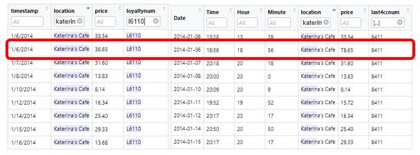

```{r setup, include=FALSE}
options(htmltools.dir.version = FALSE)
knitr::opts_chunk$set(fig.retina=3,
                       echo = TRUE,
                       eval = TRUE,
                       message = FALSE,
                       warning = FALSE)
```

# 1. Introduction

[Mini-Challenge 2 (MC2)](https://vast-challenge.github.io/2021/MC2.html) is one of the 3 challenges from the VAST 2021 Challenge. An interesting note is that the VAST 2021 Challenge is actually adapted from the VAST 2014 Challenge. 

For our chosen challenge, MC2, the main objective is to use the given data to discover unusual patterns in employees’ daily lives from their credit/loyalty card records and the GPS tracking records of their cars.  

# 2. Literature Review

We conduct a review of how the analysis was conducted previously for the VAST 2014 challenge. In particular, we looked at analyses conducted by a team from Peking University (PKU) [(Chen, 2014)](http://simingchen.me/docs/vastchallenge14-mc2.pdf) and the team from the University of Konstanz (UoK) [(Fischer, 2014)](http://vis.cs.ucdavis.edu/vis2014papers/VIS_Conference/vast/challenge/Fischer_02.pdf). The approach that both teams took involved the cross analysis and merging of all data files.

The team from PKU proposed a multi-filter visual analytics web-based system for movement data investigation called Movement Finder. Their system integrates movement information from different datasets. With various visualizations and multiple filters, it is able to summarize the general movement patterns of a group of people, and help analysts detect abnormal events. 



The team assumed some definitions when building this application - they defined all stops above 1 minute in the GPS data as events and they defined some Point-of-Interests(POIs) by categorising the different locations present from the tourist map. If a car's GPS data indicated that the car's location was within the boundary of a POI, it would be assumed that car was at the particular POI.  

On the other hand, the team from UoK presented a Geographic Information System (GIS) aimed to interactively analyze the complex geo-temporal data of MC2. A time series indicates the amount of movement over time that guides the user to interesting time frames. Through the GIS developed, suspects and location types can be interactively filtered to discover unexpected behaviour patterns.  


Both teams offered interactive techniques to identify abnormal events. However, as we are dealing with geospatial data for this mini-challenge, the interface of the solution presented by PKU is especially visual, intuitive and user-friendly.

# 3. Data Preparation

### 3.1 Loading the Datasets  

Load the relevant packages into R. These R packages will be used to read the data and plot the visualizations.

```{r, layout="l-body-outset", preview=TRUE}
packages = c('tmap','clock','leaflet','mapview','DT', 'ggiraph', 'plotly', 'shiny', 'tidyverse', 'dplyr','tibbletime', 'lubridate', 'rgdal', 'readr', 'sf', 'raster','igraph','tidygraph', 'ggraph','visNetwork','mapview','forcats')

for(p in packages){
  if(!require(p, character.only = T)){    
    install.packages(p)  
  }  
  library(p, character.only = T)
}
```

Then, we import all the necessary datasets.

```{r, layout="l-body-outset", preview=TRUE}
cc_data <- read_csv("cc_data.csv")
glimpse(cc_data)
loyalty_data <- read_csv("loyalty_data.csv")
glimpse(loyalty_data)
car_assignments <- read_csv("car-assignments.csv")
glimpse(car_assignments)
gps <- read_csv("gps.csv") 
glimpse(gps)
```

### 3.2 Data Wrangling

We note that the timestamp fields across the datasets are not in date-time format and also, the Car ID field should be in factor data type.

Hence, before we proceed, we want to transform the values in the timestamp field into the correct date-time format. An additional step for the credit card (cc) and the gps data is deriving a day-of-month field and a hour-of-day field from the timestamp. 

Specifically, for the cc dataset, we also want to transform values in last4ccnum field to character data type. We will create a separate format for the cc data for merging with the loyalty data later on.

```{r, layout="l-body-outset", preview=TRUE}
cc_data1 <- separate(cc_data, timestamp, into = c("Date", "Time"), sep = " ")
cc_data1$Date <- date_time_parse(cc_data1$Date,
                                 zone = "",
                                 format = "%m/%d/%Y")

cc_data$timestamp <-  date_time_parse(cc_data$timestamp,
                                      zone = "",
                                      format = "%m/%d/%Y %H:%M")
cc_data$last4ccnum <- as.character(cc_data$last4ccnum)
cc_data$Day  = get_day(cc_data$timestamp)
cc_data$Hour = get_hour(cc_data$timestamp)

glimpse(cc_data)

loyalty_data$timestamp <- date_time_parse(loyalty_data$timestamp,
                                 zone = "",
                                 format = "%m/%d/%Y")

glimpse(loyalty_data)

gps$Timestamp <-  date_time_parse(gps$Timestamp,
                                      zone = "",
                                      format = "%m/%d/%Y %H:%M")
gps$Day  = get_day(gps$Timestamp)
gps$Hour = get_hour(gps$Timestamp)

glimpse(gps)
```

In the code below, the as_factor() of forcats package is used to convert values in the Car ID fields from numerical to factor data type.

```{r, layout="l-body-outset", preview=TRUE}
gps$id<- as_factor(gps$id)
glimpse(gps)

car_assignments$CarID <- as_factor(car_assignments$CarID)
glimpse(car_assignments)
```

We will also rename the timestamp field of the loyalty data to 'Date' and the ID field of the gps data to 'CarID'.

```{r, layout="l-body-outset", preview=TRUE}
names(loyalty_data)[names(loyalty_data) == "timestamp"] <- "Date"
colnames(loyalty_data)
names(gps)[names(gps) == "id"] <- "CarID"
colnames(gps)
```

Next, we convert the datasets (which are in CSV format) to dataframes for easy manipulation in R.

```{r, layout="l-body-outset", preview=TRUE}
df_cc_data = data.frame(cc_data)
df_cc_data1 = data.frame(cc_data1)
df_loyalty_data = data.frame(loyalty_data)
df_car_assignments = data.frame(car_assignments)
df_gps = data.frame(gps)
```

After this, we want to merge the cc and loyalty datasets together to get a holistic view of employee spending. We do this by matching the 2 relevant datasets by "Date", "location" and "price".

```{r, layout="l-body-outset", preview=TRUE}
cc_loyalty <- merge(df_cc_data1,df_loyalty_data,by=c("Date","location", "price"))
glimpse(cc_loyalty)
```

Next, we merge the car assignment and gps dataset together.

```{r, layout="l-body-outset", preview=TRUE}
gps_car_assignments <- merge(df_gps,df_car_assignments,by=c("CarID"))
glimpse(gps_car_assignments)
```

We will now move on to answer the MC2 tasks.

# 4. Tasks & Questions

### 4.1 Using just the credit and loyalty card data, identify the most popular locations, and when they are popular. What anomalies do you see? What corrections would you recommend to correct these anomalies? Please limit your answer to 8 images and 300 words.  

Based on the cc data, the top 5 most popular locations are:  

```{r, layout="l-body-outset", preview=TRUE}
location_count <- df_cc_data %>% count(location)
top_5_locations <- head(arrange(location_count,desc(n)),n=5)
ggplot(top_5_locations, aes(x=reorder(location, -n),y=n))+
  geom_col()+
  theme(axis.text.x=element_text(angle=45, hjust=1))+
  geom_text(aes(label = n), vjust = -0.2)+
  ggtitle("No. of CC transactions at the top 5 most popular locations")+
  xlab("Location") + ylab("No. of CC transactions")+
  ylim(0, max(top_5_locations$n) * 1.1)
```

The most popular locations are the ones which serve food and drinks. Amongst these locations, there is a clear divide between those locations which are popular for lunch/dinner and those which are popular for breakfast. For example, for the top 3 locations - Katerina’s Cafe, Hippokampos and Guy's Gyros, the cc transactions occurred mostly between 1pm to 3pm and between 7pm to 10pm. As for the 4th and 5th most popular location – Brew’ve Been Served and Hallowed Grounds, the cc transactions occurred mostly between 7am to 9am. Another observation is that most of the transactions occurred before working hours, during lunch breaks and after working hours.

```{r, layout="l-body-outset", preview=TRUE}
Katcafe <- df_cc_data %>% filter(location == "Katerina's Cafe") %>% count(Hour)
ggplot(Katcafe, aes(x=reorder(Hour, -n),y=n))+
  geom_col()+
  theme(axis.text.x=element_text(angle=360, hjust=1))+
  geom_text(aes(label = n), vjust = -0.2)+
  ggtitle("No. of transactions per hour at Katerinas Cafe")+
  xlab("Hour of Day") + ylab("No. of CC transactions")
```

```{r, layout="l-body-outset", preview=TRUE}
HallowedG <- df_cc_data %>% filter(location == "Hallowed Grounds") %>% count(Hour)
ggplot(HallowedG, aes(x=reorder(Hour, -n),y=n))+
  geom_col()+
  theme(axis.text.x=element_text(angle=360, hjust=1))+
  geom_text(aes(label = n), vjust = -0.2)+
  ggtitle("No. of transactions per hour at Hallowed Grounds")+
  xlab("Hour of Day") + ylab("No. of CC transactions")
```

Looking at the loyalty data shows us that the locations with the highest number of cc transactions mostly align with the locations with the highest number of loyalty transactions recorded.

```{r, layout="l-body-outset", preview=TRUE}
location_count1 <- df_loyalty_data %>% count(location)
top_5_locations1 <- head(arrange(location_count1,desc(n)),n=5)
ggplot(top_5_locations1, aes(x=reorder(location, -n),y=n))+
  geom_col()+
  theme(axis.text.x=element_text(angle=45, hjust=1))+
  geom_text(aes(label = n), vjust = -0.2)+
  ggtitle("No. of loyalty transactions at the top 5 most popular locations")+
  xlab("Location") + ylab("No. of loyalty transactions")+
  ylim(0, max(top_5_locations$n) * 1.1)
```

There are some anomalies observed.  

*	The cc data and loyalty data were of varying resolution. While cc data was available to the minute, the loyalty card information was available only at day level. We dealt with this anomaly with our data wrangling in an earlier section - deriving the date field from the CC data.

* Not all cc transactions had corresponding loyalty transactions. This is obvious from the different number of rows in the cc dataset and the loyalty dataset.

```{r, layout="l-body-outset", preview=TRUE}
nrow(df_cc_data)
nrow(df_loyalty_data)
```

* All transactions at Bean There Done That, Brewed Awakenings, Jack's Magical Beans, and Coffee Shack occurred at 12pm. This s extremely unlikely.

```{r, layout="l-body-outset", preview=TRUE}
BrewedAw <- df_cc_data %>% filter(location == "Brewed Awakenings") %>% count(Hour)
ggplot(BrewedAw, aes(x=reorder(Hour, -n),y=n))+
  geom_col()+
  geom_text(aes(label = n), vjust = -0.2)+
  ggtitle("No. of transactions per hour at Brewed Awakenings")+
  xlab("Hour of Day") + ylab("No. of CC transactions")
```

```{r, layout="l-body-outset", preview=TRUE}
BTDT <- df_cc_data %>% filter(location == "Bean There Done That") %>% count(Hour)
ggplot(BTDT, aes(x=reorder(Hour, -n),y=n))+
  geom_col()+
  geom_text(aes(label = n), vjust = -0.2)+
  ggtitle("No. of transactions per hour at Bean There Done That")+
  xlab("Hour of Day") + ylab("No. of CC transactions")
```

* An anomalous transaction with a value of $10,000 occurred at Frydos Autosupply n' More. The transaction took place on January 13th at 7.20pm and the last 4 cc number was 9551. We can use the gps data later to identify which car was around the area at approximately the same timing to know which employee made that transaction.  

```{r, layout="l-body-outset", preview=TRUE}
boxplot <- ggplot(cc_data,aes(y = price, x= location)) +
  geom_boxplot_interactive(aes(tooltip = price)) +
  theme(axis.text.x=element_text(angle=90, hjust=1))+
  ylim(0, max(cc_data$price) * 1.1)
  
girafe(
  ggobj = boxplot,
  width_svg = 6,
  height_svg = 6*0.618
)
```

* Some corresponding loyalty card transactions are lower than the price charged to the cc. E.g. at Katerina’s Cafe, we see that by matching the loyalty card number, cc number and price, we infer that for the second transaction charged to card ending 8411, only $38.65 was charged to the loyalty card while $78.65 was charged to the cc, a discrepancy of $40. This is just one of the examples where the amount charged to the loyalty card was less than the amount charged to the cc card.



### 2. Add the vehicle data to your analysis of the credit and loyalty card data. How does your assessment of the anomalies in question 1 change based on this new data? What discrepancies between vehicle, credit, and loyalty card data do you find? Please limit your answer to 8 images and 500 words.  

We first import in the raster file and plot the raster layer. We also import the vector GIS data file and convert the gps data into a simple feature data frame. Last but not least, we create movement paths from the gps points.

```{r, layout="l-body-outset", preview=TRUE}
bgmap <- raster("MC2-tourist_modified.tif")
tmap_mode("plot")
tm_shape(bgmap) +
    tm_raster(bgmap,
              legend.show = FALSE)

tm_shape(bgmap) +
tm_rgb(bgmap, r = 1,g = 2,b = 3,
       alpha = NA,
       saturation = 1,
       interpolate = TRUE,
       max.value = 255)

Abila_st <- st_read(dsn = "Geospatial",
                    layer = "Abila")

gps_sf <- st_as_sf(df_gps, 
                   coords = c("long", "lat"),
                       crs= 4326)
gps_path <- gps_sf %>%
  group_by(CarID) %>%
  summarize(m = mean(Timestamp), 
            do_union=FALSE) %>%
  st_cast("LINESTRING")

library(mapview)
p = npts(gps_path, by_feature = TRUE)
gps_path2 <- cbind(gps_path, p)
df_gps_path2 = data.frame(gps_path2)
```

There are some limitations to using the gps data - gps data are not collected while the car (and gps) is turned off, thus no movement is recorded. 

Also, we note that the gps of Car 28, owned by Isande Borrasca is probably malfunctioning as the gps data showed disorganized placements. 

```{r, layout="l-body-outset", preview=TRUE}
gps_path_selected <- gps_path %>%
  filter(CarID==28)
tmap_mode("view")
tm_shape(bgmap) +
  tm_rgb(bgmap, r = 1,g = 2,b = 3,
       alpha = NA,
       saturation = 1,
       interpolate = TRUE,
       max.value = 255) +
  tm_shape(gps_path_selected) +
  tm_lines()
```

Regarding some of the anomalies identified earlier on, e.g. the anomalous transaction with a value of $10,000 taking place at Frydos Autosupply n' More on January 13th at 7.20pm, adding on the gps data allowed us to identify that the transaction was made by the owner of CarID 34, who is Edvard Vann, a member of the security department. We will need to verify later on that the cc used to make this large transaction is indeed owned by Edvard Vann.


For the anomaly where all transactions at Bean There Done That, Brewed Awakenings, Jack's Magical Beans, and Coffee Shack were time-stamped exactly at noon, we verified after checking with the gps data that the main traffic to these cafes was in the morning.

Additionally, we identified another anomaly where a view of the Kronos Mart data revealed that most of its transactions were time-stamped 12 hour later than the actual gps records. 

### 3. Can you infer the owners of each credit card and loyalty card? What is your evidence? Where are there uncertainties in your method? Where are there uncertainties in the data? Please limit your answer to 8 images and 500 words. 

We can infer the owners by considering the linkages between the datasets as below.


Firstly, we match the owners of the cc with the corresponding loyalty cards by matching the date, location and price. Then by matching the timestamps and longitude/latitude data in the gps dataset with the timestamps and location on the cc data, we infer which were the Car IDs used to bring the individual to the location. Finally we matched the Car ID information to the employees.

For example, for cc with last 4 numbers 9551, by checking the timing of the cc transactions against the gps data, we were able to infer that the owner of CarID 1, Nils Calixto, is the owner of the cc. As an example, Nils entered Hallowed Grounds at 7.22am on January 13th and left at 7.57am after making payment at 7.55am.


We repeated the same verification process across multiple transactions for all cc transactions and were able to match the owners of the credit cards as below.

```{r, layout="l-body-outset", preview=TRUE}
CC_owner <- read_csv("CC_owner.csv")
df_CC_owner = data.frame(CC_owner)
glimpse(df_CC_owner)
```

As we had already merged the cc and loyalty dasets together earlier, by default, we know who are the owners of the different loyalty cards.

```{r, layout="l-body-outset", preview=TRUE}
gps_car_cc <- merge(df_CC_owner,df_car_assignments,by=c("CarID"))
final_cc <- merge(gps_car_cc, cc_loyalty,by=c("last4ccnum"))
glimpse(final_cc)
```

There were some limitations with our method:  

1. There were no car IDs associated with some transactions - 372 transactions had no associated CarID. This means that the cc data captured transactions which were not conducted by the employees in the list given to us. The cc with no associated car IDs could have belonged to the truck drivers too.  

```{r, layout="l-body-outset", preview=TRUE}
CCownerCar <- merge(df_CC_owner, df_cc_data, all = TRUE)
CCownerCar$CarID <- as_factor(CCownerCar$CarID)
summary(CCownerCar)
```

2. There are numerous card IDs which enter/exit the same location at the same time. We can only assume that the cc card most associated with the particular car ID was indeed owned by the owner of that car ID.  

3. The individual might have stayed in the store for a long time before and after making the purchase. Hence, matching the timestamps in the gps dataset and the timestamps in the cc data would not provide us accurate information.  

4. Due to the some of the informal relationships (employees being in a relationship), they might use their partner’s cc to make purchases. E.g. the anomalous transaction with a value of $10,000 taking place at Frydos Autosupply n' More on 13th January 2021 at 7.20pm was made by the owner of CarID 34, Edvard Vann. This transaction was made using the cc with last 4 numbers 9551, which is owned by the owner of car ID 1, Nils Calixto. However, car ID 1 was nowhere near the shop when this transaction was made.

5. Truck drivers do not have their own Car ID and they only work during the weekdays. Hence, it is not possible to match them to any cc transactions during the weekends accurately.

### 4. Given the data sources provided, identify potential informal or unofficial relationships among GASTech personnel. Provide evidence for these relationships. Please limit your response to 8 images and 500 words.  

1. Brand Tempestad(33) and Elsa Orilla(7) had synchronous hotel consumption records at noon on numerous days, They drove their cars to the hotel from GASTech on January 8 and January 10 at similar timings and both individuals had spending records there. They might be in a romantic relationship.


2. We checked the gps data across time for Lidelse Dedos(14) and Birgitta Frente(18) and realised that they have very similar travelling patterns, indicating that they probably spend a lot of time together. They probably have a romantic relationship.

```{r, layout="l-body-outset", preview=TRUE}
gps_path_selected <- gps_path %>%
  filter(CarID==14)
tmap_mode("view")
tm_shape(bgmap) +
  tm_rgb(bgmap, r = 1,g = 2,b = 3,
       alpha = NA,
       saturation = 1,
       interpolate = TRUE,
       max.value = 255) +
  tm_shape(gps_path_selected) +
  tm_lines()
```

```{r, layout="l-body-outset", preview=TRUE}
gps_path_selected <- gps_path %>%
  filter(CarID==18)
tmap_mode("view")
tm_shape(bgmap) +
  tm_rgb(bgmap, r = 1,g = 2,b = 3,
       alpha = NA,
       saturation = 1,
       interpolate = TRUE,
       max.value = 255) +
  tm_shape(gps_path_selected) +
  tm_lines()
```

3. Linking to the above point, it seems that Hennie Osvaldo(21) often visits Lidelse (14) and Birgitta (18) and sometimes spends the night together, e.g. January 8, January 11th-January 12th, January 15, and January 18. The three of them might be good friends, even out of the workplace context.

4. Looking at the spending history of Nils Calixto, one transaction stood out, corresponding to $10,000 at Frydo’s Autosupply n’ More. Nils was not there when the spending occurred. The CarID that corresponded to this transaction was CarID 34 which is owned by Edvard Vann. They could be co-conspirators and Edvard used Nils' credit card.


5.  Ingrid Barranco (4) and Minke Mies (24) are also often together, e.g. they were both at Albert’s Fine Clothing  for a few hours together on January 11. They might have used each other’s credit card due to being in a relationship.


### 5. Do you see evidence of suspicious activity? Identify 1- 10 locations where you believe the suspicious activity is occurring, and why Please limit your response to 10 images and 500 words.  

1. Frydos Autosupply n’ More. First, we noticed that there were some regular spending records with no gps records. These transactions could have belonged to the truck drivers who have no cars and hence, no gps records.Their frequent spending patterns might be because they have to service the trucks.

    Also, we see that there are numerous occasions where members of the security department make purchases at the autosupply shop together at close intervals. This is unusual and could be an indication that the entire team might be involved in the kidnapping incident.


2. Chotus hotel. As mentioned in the earlier section, Brand Tempestad(33) and Elsa Orilla(7) had synchronous hotel consumption records at noon on numerous days. The hotel might be a hotspot for their rendezvous.

3. Kronos Capitol near Abila Park. We found that Loreto Bodrogi(15), Edvard Vann (34), and Kanon Herrero (25) were all there at about 1pm and stayed on for a few hours on January 18. They might be gathering to discuss about the kidnapping incident.


4. By analyzing gps data, we were able to identify the locations of the four executives’ houses. Analyzing the gps data revealed that they usually stay at home at night and during the weekends. We found that there were groups of employees who stayed at each of their places at the night of a particular day till the morning, e.g., Isia(16) and Loreto(15) at Ada Campo-Corrente’s on January 7th - January 8th, Minke(24) and Loreto at Orhan Strum’s on January 8th - January 9th, Minke and Loreto at Orhan Strum’s on January 8th - January 9th, Hennie(21) and Isia at Williem Vasco-Pais’ on January 10th-January 11th, and Minke and Hennie at Ingrid Barranco’s on January 13th-January 14th. Based on their staying pattern, we guess that these people were either having discussions in their houses or they were watching/spying on them. 

5. We observed that Hennie, Isia Vann, Loreto Bodrogi, and Inga Ferro often gathered together. They appear to gather together for a short while everytime they meet (no gps movment). We checked through several spending records, e.g. Isia Vann’s spending on Guy’s Gyros on January 19 at 8pm. At this timing, we see many people had dinner at the same time on January 19, including Isia, Loreto, Minke Mies, and Edvard Vann as well as Sten Sanjorge Jr. These individuals are all members of the security and these gatherings might imply some suspicious meetings/informal relationships among them.

6. Krono's Mart. There were numerous transactions made at 3am in the morning. Of these late night transactions, 3 of them occurred on January 19, the day of the kidnapping. This is highly suspicious. The transactions were conducted by security member Varja Lagos (23), SVP/CIO Ada Campo-Corrente(10) and IT member Nils Calixto (1). Coincidentally, all three transactions did not have supporting GPS data,i.e. the gps did not reflect that they drove their cars to Krono's Mart when they made these transactions. This is highly suspicious.


We see that there are many suspicious activities involving the security department and Nils Calixto who belongs to IT. It is highly probable that these individuals are involved in the kidnapping incident.

### 6. If you solved this mini-challenge in 2014, how did you approach it differently this year?  

One main difference in my approach would be to examine the datasets for the other mini-challenges. While the datasets for MC2 help to paint a picture of the employees' lives, the datasets from MC1 and MC3 would help to explain the linkages between the employees better and also allow us to paint a proper timeline of incidents leading up to the major event.