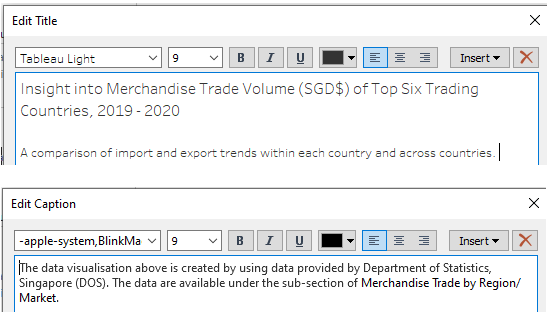

```{r setup, include=FALSE}
knitr::opts_chunk$set(echo = FALSE)

# Learn more about creating blogs with Distill at:
# https://rstudio.github.io/distill/blog.html

```
# 1. Critique of the Visualisation

This is the original visualisation.


## 1.1 Clarity

1.	The title of the visualisation, ‘Merchandise Trade of Top Six Trading Countries, 2019-2020’, is vague and unclear. While readers might expect to see a graph comparing the overall merchandise trade volume across the top six trading countries from 2019 to 2020, the original visualisation is instead showing us the import and export volumes in each of the six countries from 2019 to 2020. 

2.	Following up with point 1, the title does not indicate if the trade volume is measured in dollars or in units. The Y-axis has no units too. If the trade volume is indeed measured in dollars, it is unclear what currency is used as the basis for measurement. While these two datasets come from a Singapore-governed website, the source is not explicitly stated on the graph and hence, it will not be immediately obvious to anyone looking at the visualisation that the measurement is in SGD$. The unit of measurement should be indicated in the visualisation and there should be a caption indicating the data source.

3.	With a title that indicates a ranking (top six), individuals would expect to see a clear ranking of these six countries. However, there is no clear ranking indicated in this visualisation.

4.	The title of the visualisation would lead individuals to expect to see data from 2019 to 2020. However, the visualisation for Japan only has 2020 data.

5.	The visualisation for each of the six countries has a different Y-axis scale and the difference in scale across the is not conveyed properly. Thus, it is hard to make comparisons of the data presented in the visualisations.

6.	The title of the X-axis is ‘Month of Period’ but the labels on the X-axis indicate the year instead of the month.

## 1.2 Aesthetic

1.	There is poor use of colours in the chart. The overlapping of colours make it extremely hard to compare import and export trends for each country.

2.	The layout of the chart makes it difficult to infer any comparisons or observations across countries.

3.	The size of the six charts are all different. For example, the chart for Mainland China is much wider than the rest while the chart for Japan is much narrower than the rest.

# 2.0 Alternative Design

The proposed design is as follows.It will be a dashboard consisting of a faceted line graph, a bar chart and a line graph.


## 2.1 Clarity

1. We utilise 3 charts - a faceted line graph (main chart), a bar chart and a line graph to convey the necessary information.

    + The faceted line graph will show the trend in exports and imports in the six countries throughout 2019 to 2020.
    + The bar chart will show the overal volume of merchandise trade in the six countries for the entire time period from 2019 to 2020.
    + The line graph will show the trend in overall merchandise trade volume in the six countries throughout 2019 to 2020.

2.	We will include clear titles for each of the charts. For the main chart, we will also add in a subtitle to explain the intention of our visualisation clearly.

    * Main chart - Faceted line graph

        + Title: Insight into Merchandise Trade Volume (SGD$) of Top Six Trading Countries, 2019 - 2020
        + Subtitle: A comparison of import and export trends within each country and across countries

    * Bar chart

        + Title: Total Merchandise Trade Volume (SGD$) of Top Six Trading Countries, 2019 - 2020

    * Line graph

        + Title: Total Merchandise Trade Volume (SGD$) Trend, 2019 - 2020 

3. We will include a caption to indicate the source of the data.

4.	The unit of measurement will added to the title and the Y-axis of all three charts to make it clear that the trade volume is measured in SGD$.

5.	For easy comparison, we will utilise a dual axis and align the Y-axis scale in the faceted line graph.

6.	We will scale the X-axis to the month of year.

## 2.2 Aesthetic

1.	The layout, the Y-axis scale and the X-axis scale of the visualization will be amended to make it easier to form comparisons and observations.

2.	We will use line graphs instead of area charts so that there will be no overlapping of colours which make the visualisation confusing.

3. We will ensure that all charts are of the same size.

# 3.0 Proposed Visualisation

Please view the visualisation on Tableau Public [here](https://public.tableau.com/app/profile/joanna.lian/viz/DataViz1_16218253734530/Story1).

# 4.0 Step-by-step Guide
We will provide a step-by-step guide on how to create our proposed alternative static data visualisation.

**Data Sources**

The datasets used for this data visualisation were extracted from [singstat]( https://www.singstat.gov.sg/find-data/search-by-theme/trade-and-investment/merchandise-trade/latest-data.). Specifically, they can be found under the following sections:

*	[Merchandise Imports By Region/Market, Monthly](https://www.tablebuilder.singstat.gov.sg/publicfacing/createDataTable.action?refId=15544)
*	[Merchandise Exports By Region/Market, Monthly](https://www.tablebuilder.singstat.gov.sg/publicfacing/createDataTable.action?refId=15534)

**Data Preparation**

Screenshots of the raw dataset are as shown below:


It is noted that we do not need many of the data present in the raw dataset and also, there is some other data that we need but are not available in the dataset. Hence, we will conduct some transformation of the data.

The data transformation steps (done in Microsoft Excel) are as follows:

*	For both tables, we removed data from January 1976 to December 2018 and from January 2021 to April 2021. We also removed the data which represent regional values – rows 8 to 13 in the raw datasets. This is because we are interested only in country-level data for this visualisation.
*	We created a new table, Total Merchandise Volume, which indicates total merchandise trade volume, i.e. the sum of exports and imports, for each country for each month from January 2019 to December 2020. In this new table, we added a column at the far end to indicate total trade for each country for the entire time period from January 2019 to December 2020.


*	Next, using the Total Merchandise Volume table, we ranked the countries according to the total trade conducted between January 2019 to December 2020. We are only interested in the top six countries which are in order – Mainland China, Malaysia, United States, Taiwan, Hong Kong and Indonesia.


*	Lastly, we cleaned up and reformatted the data in the Total Merchandise Volume table into a new table called CleanData by extracting only the data for the top six countries and reformatting the data to make it easier to use on Tableau.

The transformed dataset is shown below:


This dataset is then uploaded into Tableau.

We will now create our visualisations consisting of a bar chart, a line graph and a faceted line graph which we will combine together to form a static dashboard which will be our final visualisation.

## 4.1 Bar Chart

Firstly, we use a bar chart to illustrate the ranking of the total merchandise trade volume during the time period from January 2019 to December 2020 for the top six countries.

1.	Drag **Country** from Dimensions to Rows and **Total** from Measures to Columns. By default, the sum of **Total** is taken.


2. By double clicking on the title of the bar chart, we amend the title of the bar chart to ‘Total Merchandise Trade Volume (SGD$) of Top Six Trading Countries from 2019 -2020’. 


3.	Next, we right-click on one of the bars in the bar chart, select **Mark Label** and click **Annotate**. The corresponding value for the bar will then appear on the chart. We repeat this step for all the bars.


4.	Now, we want to add a caption to indicate the data source. We right-click on any spot just outside the chart and select **Caption**. 


We add in the following caption:


5.	We change the colour of the bars to a dark grey.


6.	This is our final end-product. We call this sheet ‘Total MTV’.


## 4.2 Line Graph

We now create a line graph to observe the trend in total merchandise trade volume in each of the six countries from January 2019 to December 2020.

1.	Drag **Month** from Dimensions to Columns and **Total** from Measures to Rows. By default, the sum of **Total** is taken. We want both the year and month component of **Month** to be displayed,


2.	Drag **Country** to colour.


3.	We edit the label of the Y-axis to ‘Total Merchandise Trade Volume (SGD$)’ to make the intention of the line graph clearer.


4.	Similar to before, we amend the title and we add in a caption to indicate the data source as well. This is the end product. We call this sheet ‘Total MTV Trend’.


## 4.3 Faceted line graph

We now create a faceted line graph to observe the trend of imports and exports in each of the six countries from January 2019 to December 2020

1.	Drag **Month** from Dimensions to Columns (both year and month components displayed), **Country** from Dimensions to Rows and **Exports** and **Imports** from Measures to Rows. The sum of **Exports** and the sum of **Imports** are taken.


2.	Using the same steps as we did before, We amend the Y-axis labels accordingly, update the title/subtitle and we add in a caption to indicate the data source as well.



3.	We create a dual axis by right clicking on **SUM(Imports)** and selecting **Dual Axis**.


4.	We edit the colour of the line graphs to make the colours contrast and stand out more.


5.	This is the end-product. We call this sheet ‘MTV (Imp&Exp)’.


## 4.4 Dashboard

We create a static dashboard which combines the bar chart, line graph and faceted line graph which we have created.


## 4.5 Story

As a final step, we create a story on Tableau using the dashboard that we have created. We drag the dashboard that we have created to the story,


After which, we add in a caption to explain the objective of the visualisation.


# 5.0 Three major observations

1.	For the top three countries – Mainland China, Malaysia and the United States, the volume of imports and exports for each of these countries is similar. This is in contrast to the next three countries – Taiwan, Hong Kong and Indonesia where the volume of imports and exports for each of these countries is very different. For example, the volume of imports into Taiwan is far higher than the volume of exports. In contrast, for Hong Kong and Indonesia, the volume of exports is far higher than the volume of imports.  Such differences highlight the differences in characteristics between these six economies and it will be interesting to deep-dive into the main industries which encompass these countries’ trade.

2.	Fluctuations in trade volume were more pronounced in 2020 than in 2019. This is likely due to the covid-19 pandemic. In the first six months of 2020, we observe that these top six countries largely saw a sharp decrease in trade volume as the pandemic led to border closures all around the world. 

3.	Looking at the overall merchandise trade volume trend for the six countries, we can observe that apart from Mainland China which experienced growth in trade volume, the other five countries’ trade volume did not grow much from January 2019 to December 2020. This was largely due to China being able to recover its economy much faster than other countries during the covid-19 pandemic. 


